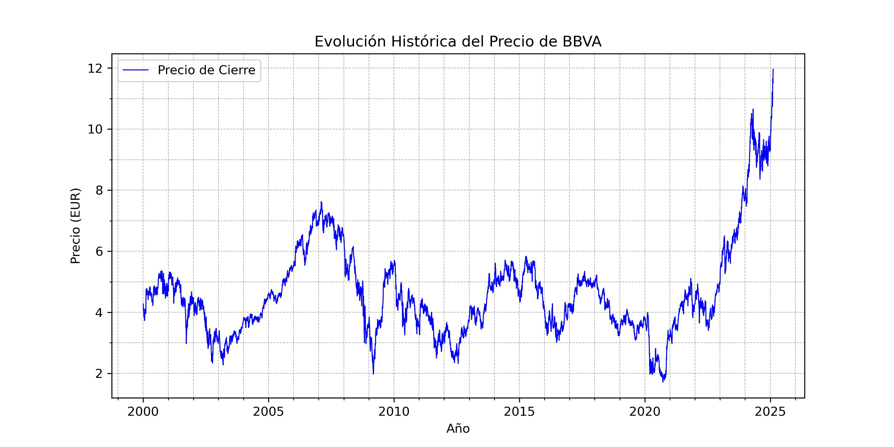

# 📈 BBVA Stock Price Prediction with Machine Learning (...IN PROGRESS...)
**Note:** This project is currently a **work in progress**.

This repository contains a project aimed at **predicting the stock price of BBVA** using **Machine Learning** techniques. The goal is to analyze historical BBVA data and build models to estimate its future price movements.

## 🔍 **What’s in this repository?**  
- Downloading historical BBVA data from Yahoo Finance  
- Exploratory Data Analysis (EDA) and trend visualization  
- Application of Machine Learning models such as **Linear Regression, Random Forest, and Neural Networks**  
- Evaluation of model performance using metrics like **RMSE and R²**  
- Predictions and result visualization  

## 🛠 **Technologies used**  
- Python 
- `yfinance` for financial data download  
- `pandas` and `numpy` for data manipulation  
- `matplotlib` and `seaborn` for visualization  
- `scikit-learn` and `TensorFlow/PyTorch` for Machine Learning models  

## 🚀 **Final goal**  
This project aims to demonstrate how Machine Learning techniques can be applied to financial market analysis and assist in decision-making.

## 📝 **How to Use**  
1. Clone the repository:  
   ```bash
   git clone https://github.com/yourusername/bbva-stock-prediction.git


## 📌 General Workflow  

1. **Importing Required Packages and Modules**

```Python
import yfinance as yf
import matplotlib.pyplot as plt
import matplotlib.dates as mdates

# Descargar datos históricos de BBVA (Bolsa de Madrid)
bbva = yf.Ticker("BBVA.MC")
hist = bbva.history(period="max")

# Crear la figura
plt.figure(figsize=(10,5))
plt.plot(hist.index, hist["Close"], label="Precio de Cierre", color="b", linewidth=0.8)  # Línea más delgada

# Personalización del gráfico
plt.xlabel("Año")
plt.ylabel("Precio (EUR)")
plt.title("Evolución Histórica del Precio de BBVA")
plt.legend()
plt.grid(True, which='both', linestyle='--', linewidth=0.5)

# Configurar ticks mayores y menores en el eje X (años)
ax = plt.gca()  # Obtener eje actual
ax.xaxis.set_major_locator(mdates.YearLocator(5))  # Ticks mayores cada 5 años
ax.xaxis.set_minor_locator(mdates.YearLocator(1))  # Ticks menores cada 1 año
ax.xaxis.set_major_formatter(mdates.DateFormatter('%Y'))  # Formato de año en ticks mayores

# Configurar ticks menores en el eje Y (precio)
ax.yaxis.set_minor_locator(plt.MultipleLocator(1))  # Ticks menores cada 1 unidad en el precio

# Guardar el gráfico en formato JPG con alta calidad
plt.savefig("bbva_precio_historico.jpg", format='jpg', dpi=300)  

# Mostrar el gráfico
plt.show()

print("Gráfico guardado como 'bbva_precio_historico.jpg'")

```

