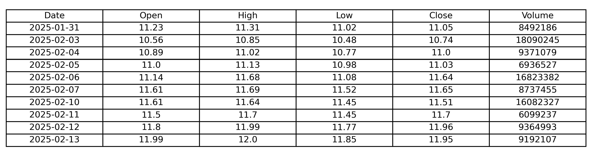
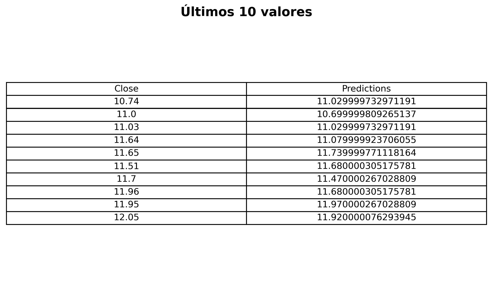
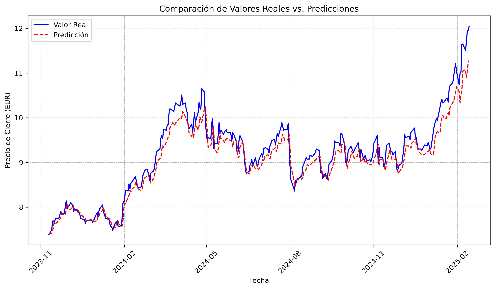

# 📈BVA Stock Price Prediction with Machine Learning

This repository contains a project aimed at **predicting the stock price of BBVA** using **Machine Learning** techniques. The goal is to analyze historical BBVA data and build models to estimate its future price movements.

## 🔍 **What’s in this repository?**  
- Downloading historical BBVA data.
- Exploratory Data Analysis (EDA) and trend visualization.  
- Application of Machine Learning models. 
- Evaluation of model performance using metrics like **RMSE**.  
- Predictions and result visualization.  

## 🛠 **Technologies used**  
- Python 
- `yfinance` for financial data download.  
- `pandas` and `numpy` for data manipulation.  
- `matplotlib` and `seaborn` for visualization.  
- `scikit-learn` and `TensorFlow/PyTorch` for Machine Learning models.  


## 📌 General Workflow  

1. **import`yfinance` for financial data download**

```Python
import yfinance as yf
import matplotlib.pyplot as plt
import matplotlib.dates as mdates
import pandas as pd

# Descargar datos históricos de BBVA (Bolsa de Madrid)
bbva = yf.Ticker("BBVA.MC")
hist = bbva.history(period="max")

# Seleccionar solo las columnas requeridas
hist = hist[['Open', 'High', 'Low', 'Close', 'Volume']]
hist.reset_index(inplace=True)  # Convertir índice (fecha) en columna normal

#Formatear la columna Date para que solo muestre "YYYY-MM-DD"
hist['Date'] = hist['Date'].dt.strftime('%Y-%m-%d')

# Redondear valores a 2 decimales
hist[['Open', 'High', 'Low', 'Close']] = hist[['Open', 'High', 'Low', 'Close']].round(2)

# Mostrar las últimas 10 filas
hist_tail = hist.tail(10)

# Mostrar tabla en consola
print("Datos históricos de BBVA (últimos 10 registros):")
print(hist_tail)

# Guardar tabla como imagen
fig, ax = plt.subplots(figsize=(10, 3))  # Crear figura
ax.axis('tight')
ax.axis('off')  # Ocultar ejes
table_data = hist_tail.values  # Datos sin encabezados
column_labels = hist_tail.columns  # Encabezados

# Crear tabla 
table = ax.table(cellText=table_data, colLabels=column_labels, cellLoc='center', loc='center')
table.auto_set_font_size(False)
table.set_fontsize(10)
table.scale(1.2, 1.2)  # Ajustar tamaño

# Guardar tabla en JPG
plt.savefig("bbva_tabla_historica.jpg", format="jpg", dpi=300, bbox_inches="tight")
plt.close()

print("Tabla guardada como 'bbva_tabla_historica.jpg'")

# Gráfico del precio del stock y Volumen
# Convertir la columna 'Date' a formato datetime
hist['Date'] = pd.to_datetime(hist['Date'])

# Crear una figura con dos subgráficas (2 columnas)
fig, (ax1, ax2) = plt.subplots(1, 2, figsize=(14, 5))  # 1 fila, 2 columnas

# Gráfico del precio histórico vs fecha (Figura 1)
ax1.plot(hist["Date"], hist["Close"], label="Precio de Cierre", color="b", linewidth=0.8)
ax1.set_xlabel("Año")
ax1.set_ylabel("Precio (EUR)")
ax1.set_title("Evolución Histórica del Precio de BBVA")
ax1.legend()
ax1.grid(True, which='both', linestyle='--', linewidth=0.5)
ax1.xaxis.set_major_locator(mdates.YearLocator(5))  # Ticks mayores cada 5 años
ax1.xaxis.set_minor_locator(mdates.YearLocator(1))  # Ticks menores cada 1 año
ax1.xaxis.set_major_formatter(mdates.DateFormatter('%Y'))  # Formato de año

# Gráfico del volumen histórico vs fecha (Figura 2)
ax2.plot(hist["Date"], hist["Volume"], label="Volumen", color="g", linewidth=0.8)
ax2.set_xlabel("Año")
ax2.set_ylabel("Volumen de Acción")
ax2.set_title("Volumen de Acciones de BBVA")
ax2.legend()
ax2.grid(True, which='both', linestyle='--', linewidth=0.5)
ax2.xaxis.set_major_locator(mdates.YearLocator(5))  # Ticks mayores cada 5 años
ax2.xaxis.set_minor_locator(mdates.YearLocator(1))  # Ticks menores cada 1 año
ax2.xaxis.set_major_formatter(mdates.DateFormatter('%Y'))  # Formato de año

# Ajustar los espacios entre las subgráficas
plt.tight_layout()

# Guardar el gráfico en JPG
plt.savefig("bbva_precio_y_volumen_historico.jpg", format='jpg', dpi=300)

# Mostrar los gráficos
plt.show()

print("Gráfico guardado como 'bbva_precio_y_volumen_historico.jpg'")

```



2. **Display descriptive statistics and information about the data**

```Python
desc_stats = hist.describe()

# Print statistics to the console
print("Descriptive Statistics for BBVA Stock Data:")
print(desc_stats)


#  Convert DataFrame to string format for display
desc_stats_rounded = desc_stats.round(3)  # Round values for better readability
desc_stats_str = desc_stats_rounded.astype(str)

#  Plot and save table as JPG
fig, ax = plt.subplots(figsize=(10, 4))  # Adjust figure size
ax.axis('tight')
ax.axis('off')  # Hide axes

# crear tabla
table = ax.table(cellText=desc_stats_str.values, 
                 colLabels=desc_stats_str.columns, 
                 rowLabels=desc_stats_str.index, 
                 cellLoc='center', loc='center')

table.auto_set_font_size(False)
table.set_fontsize(10)
table.scale(1.2, 1.2)  # Adjust size

# guardar JPG
plt.savefig("bbva_descriptive_statistics.jpg", format="jpg", dpi=300, bbox_inches="tight")
plt.close()

print("Table saved as 'bbva_descriptive_statistics.jpg'.")
```


```Python
# Información de los datos
hist.info()
print("Table saved as 'bbva_data_info.jpg'.")
```


3. **Moving average**
   
The Moving Average (MA) is a widely used technique in time series analysis to smooth short-term fluctuations and identify trends.

```Python

# Calcular las medias móviles para 10, 20 y 50 días
ma_days = [10, 20, 50]
for ma in ma_days:
    hist[f'MA {ma}'] = hist['Close'].rolling(ma).mean()

# Definir el período de zoom (últimos 365 días)
hist_zoom = hist.tail(365)

# Crear la figura principal
fig, ax1 = plt.subplots(figsize=(12, 6))

# Gráfico principal: Precio y medias móviles
ax1.plot(hist["Date"], hist["Close"], label="Precio de Cierre", color="b", linewidth=1)
ax1.plot(hist["Date"], hist["MA 10"], label="MA 10 días", color="r", linewidth=0.8)
ax1.plot(hist["Date"], hist["MA 20"], label="MA 20 días", color="g", linewidth=0.8)
ax1.plot(hist["Date"], hist["MA 50"], label="MA 50 días", color="orange", linewidth=0.8)

# Configuración del gráfico principal
ax1.set_xlabel("Año")
ax1.set_ylabel("Precio (EUR)")
ax1.set_title("Evolución Histórica del Precio de BBVA y Medias Móviles")
ax1.legend()
ax1.grid(True, which='both', linestyle='--', linewidth=0.5)
ax1.xaxis.set_major_locator(mdates.YearLocator(5))
ax1.xaxis.set_minor_locator(mdates.YearLocator(1))
ax1.xaxis.set_major_formatter(mdates.DateFormatter('%Y'))

# Dibujar líneas del Zoom
ax1.axvline(hist_zoom["Date"].iloc[0], color="gray", linestyle="--", linewidth=1.2)
ax1.axvline(hist_zoom["Date"].iloc[-1], color="gray", linestyle="--", linewidth=1.2)

# Subplot de zoom 
ax_zoom = fig.add_axes([0.45, 0.6, 0.3, 0.3])  # [left, bottom, width, height]
ax_zoom.plot(hist_zoom["Date"], hist_zoom["Close"], label="Precio de Cierre", color="b", linewidth=1.2)
ax_zoom.plot(hist_zoom["Date"], hist_zoom["MA 10"], color="r", linewidth=0.8)
ax_zoom.plot(hist_zoom["Date"], hist_zoom["MA 20"], color="g", linewidth=0.8)
ax_zoom.plot(hist_zoom["Date"], hist_zoom["MA 50"], color="orange", linewidth=0.8)
ax_zoom.set_title("Zoom: Últimos 365 días", fontsize=10)
ax_zoom.tick_params(axis='both', labelsize=8)
ax_zoom.grid(True, linestyle='--', linewidth=0.5)

# Configurar el eje X del zoom 
ax_zoom.xaxis.set_major_locator(mdates.MonthLocator(interval=2))
plt.setp(ax_zoom.xaxis.get_majorticklabels(), rotation=60)
  # Etiquetas cada 2 meses
ax_zoom.xaxis.set_major_formatter(mdates.DateFormatter('%Y-%m'))  # Formato Año-Mes

# Ajustar la disposición de la figura
plt.tight_layout()

# Guardar el gráfico en JPG
plt.savefig("bbva_precio_con_ma_zoom_centrado.jpg", format='jpg', dpi=300, bbox_inches="tight")

# Mostrar los gráficos
plt.show()

print("Gráfico guardado como 'bbva_precio_con_ma_zoom_centrado.jpg'")

```


4. **Daily return**
   
The Daily Return measures the percentage change in stock price from one day to the next.

```Python

# rendimiento diario
hist['Daily Return'] = hist['Close'].pct_change()


print("📈 Daily Return (primeros 10 registros):")
print(hist[['Date', 'Close', 'Daily Return']].head(10))

# Graficar el rendimiento diario
plt.figure(figsize=(12, 5))
plt.plot(hist["Date"], hist["Daily Return"], label="Rendimiento Diario", color="blue", linewidth=0.8)


plt.xlabel("Año")
plt.ylabel("Rendimiento Diario (%)")
plt.title("Rendimiento Diario del BBVA")
plt.axhline(0, color='black', linewidth=0.5, linestyle='--')  # Línea de referencia en 0
plt.legend()
plt.grid(True, linestyle='--', linewidth=0.5)

ax = plt.gca()
ax.xaxis.set_major_locator(mdates.YearLocator(5))  
ax.xaxis.set_minor_locator(mdates.YearLocator(1))
ax.xaxis.set_major_formatter(mdates.DateFormatter('%Y'))

# Guardar el gráfico
plt.savefig("bbva_daily_return.jpg", format='jpg', dpi=300, bbox_inches="tight")


plt.show()

print("Gráfico de rendimiento diario guardado como 'bbva_daily_return.jpg'")


```


```Python
# Histograma del rendimiento diario
plt.figure(figsize=(10, 6))
plt.hist(hist["Daily Return"].dropna(), bins=50, color="blue", alpha=0.7, edgecolor="black")


plt.xlabel("Rendimiento Diario")
plt.ylabel("Frecuencia")
plt.title("Distribución del Rendimiento Diario de BBVA")
plt.grid(axis="y", linestyle="--", linewidth=0.5, alpha=0.7)


plt.savefig("bbva_daily_return_histogram.jpg", format="jpg", dpi=300, bbox_inches="tight")


plt.show()

print(" Histograma del rendimiento diario guardado como 'bbva_daily_return_histogram.jpg'")

```


5. **Risk**
```Python
rets = hist["Daily Return"].dropna()

# Definir tamaño del punto en el gráfico
area = np.pi * 50  

# Crear la figura
plt.figure(figsize=(8, 6))
plt.scatter(rets.mean(), rets.std(), s=area, color="purple", alpha=0.6, edgecolor="black")

# Etiquetas y título
plt.xlabel("Rentabilidad Esperada")
plt.ylabel("Riesgo")
plt.title("Relación Riesgo vs. Rentabilidad - BBVA")

# Rotar los labels del eje X
plt.xticks(rotation=60)

# Anotación del punto de BBVA
plt.annotate("BBVA", xy=(rets.mean(), rets.std()), xytext=(30, -30), 
             textcoords="offset points", ha="right", va="bottom", 
             arrowprops=dict(arrowstyle="->", color="blue", lw=1.5))

# Guardar el gráfico
plt.savefig("bbva_rentabilidad_vs_riesgo.jpg", format="jpg", dpi=300, bbox_inches="tight")

# Mostrar el gráfico
plt.show()


print("Gráfico guardado como 'bbva_rentabilidad_vs_riesgo.jpg'")

```


6. **Model and results**
   
LSTM (Long Short-Term Memory) is a type of Recurrent Neural Network (RNN) designed to handle sequential data and capture long-term dependencies.

```Python


def preprocess_data(data, train_size=0.95, time_step=60):
    """Escala los datos y los divide en conjunto de entrenamiento y prueba."""
    dataset = data.values
    training_data_len = int(np.ceil(len(dataset) * train_size))

    # Escalar datos entre 0 y 1
    scaler = MinMaxScaler(feature_range=(0, 1))
    scaled_data = scaler.fit_transform(dataset)

    # Crear conjuntos de entrenamiento
    train_data = scaled_data[:training_data_len]
    x_train, y_train = [], []

    for i in range(time_step, len(train_data)):
        x_train.append(train_data[i-time_step:i, 0])
        y_train.append(train_data[i, 0])

    return np.array(x_train), np.array(y_train), scaled_data, training_data_len, scaler

def build_lstm_model(input_shape):
    """Construye y compila un modelo LSTM mejorado."""
    model = Sequential([
        LSTM(128, return_sequences=True, input_shape=input_shape),
        # Evita sobreajuste

        LSTM(64, return_sequences=True),
   

        LSTM(32, return_sequences=False),


        Dense(25, activation="relu"),  # Agrega no linealidad
        Dense(1)
    ])

    model.compile(optimizer='adam', loss='mean_squared_error')
    return model


def prepare_test_data(scaled_data, training_data_len, time_step=60):
    """Prepara los datos de prueba."""
    test_data = scaled_data[training_data_len - time_step:]
    x_test, y_test = [], scaled_data[training_data_len:, :]

    for i in range(time_step, len(test_data)):
        x_test.append(test_data[i-time_step:i, 0])

    return np.array(x_test), y_test


data = hist.filter(['Close'])  # Asegúrate de que 'hist' contenga los datos de BBVA

# Preprocesar los datos
x_train, y_train, scaled_data, training_data_len, scaler = preprocess_data(data)

x_train = np.reshape(x_train, (x_train.shape[0], x_train.shape[1], 1))

# Construir y entrenar el modelo
model = build_lstm_model((x_train.shape[1], 1))
model.fit(x_train, y_train, batch_size=1, epochs=1)

# Preparar datos de prueba y hacer predicciones
x_test, y_test = prepare_test_data(scaled_data, training_data_len)
x_test = np.reshape(x_test, (x_test.shape[0], x_test.shape[1], 1))
predictions = model.predict(x_test)
predictions = scaler.inverse_transform(predictions)
valid = data[training_data_len:]
valid['Predictions'] = predictions

# Calcular RMSE
rmse = np.sqrt(np.mean((predictions - scaler.inverse_transform(y_test)) ** 2))
print(f"RMSE: {rmse}")
# Calcular R²
r2 = r2_score(scaler.inverse_transform(y_test) , predictions)
print(f"R²: {r2}")

# Graficar los resultados 
train = data[:training_data_len]
plt.figure(figsize=(16, 6))
plt.title('Predicción del Precio de BBVA con LSTM')
plt.xlabel('Fecha', fontsize=14)
plt.text(0.05, 0.95, f'RMSE: {rmse:.2f}\nR²: {r2:.4f}', 
         transform=plt.gca().transAxes, fontsize=12,
         verticalalignment='top', bbox=dict(facecolor='white', alpha=0.5))

plt.ylabel('Precio de Cierre (EUR)', fontsize=14)
plt.plot(train['Close'], label='Entrenamiento', color='blue')
plt.plot(valid[['Predictions']], label='Predicciones', color='red')
plt.legend(loc='lower right')


plt.savefig("bbva_predicciones_solo_train.jpg", format="jpg", dpi=300, bbox_inches="tight")
print("Gráfico guardado como bbva_predicciones.jpg")


plt.show()


comparison_df = valid[['Close', 'Predictions']].copy()
comparison_df = comparison_df.round(2)  # Redondear para mejor visualización
comparison_df = comparison_df.tail(10)  # Seleccionar los últimos 10 registros

#tabla
fig, ax = plt.subplots(figsize=(8, 5))
ax.set_title("Últimos 10 valores", fontsize=14, fontweight="bold", pad=15)
ax.axis('tight')
ax.axis('off')

table = ax.table(cellText=comparison_df.values, 
                 colLabels=comparison_df.columns, 
                 cellLoc='center', 
                 loc='center')

table.auto_set_font_size(False)
table.set_fontsize(10)
table.scale(1.2, 1.2)

# Guardar 
plt.savefig("bbva_comparacion_real_vs_pred.jpg", format="jpg", dpi=300, bbox_inches="tight")
plt.close()

print("Tabla guardada como 'bbva_comparacion_real_vs_pred.jpg'")


```





