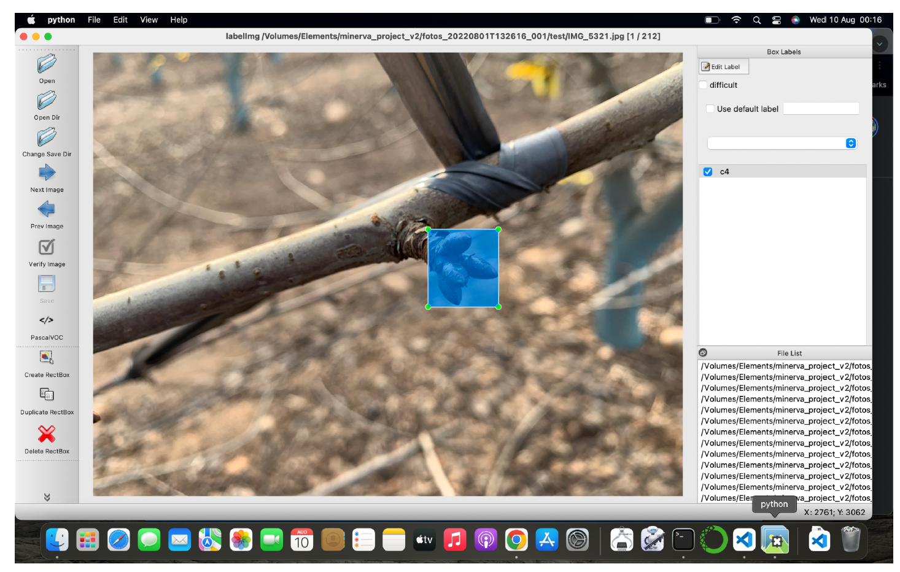
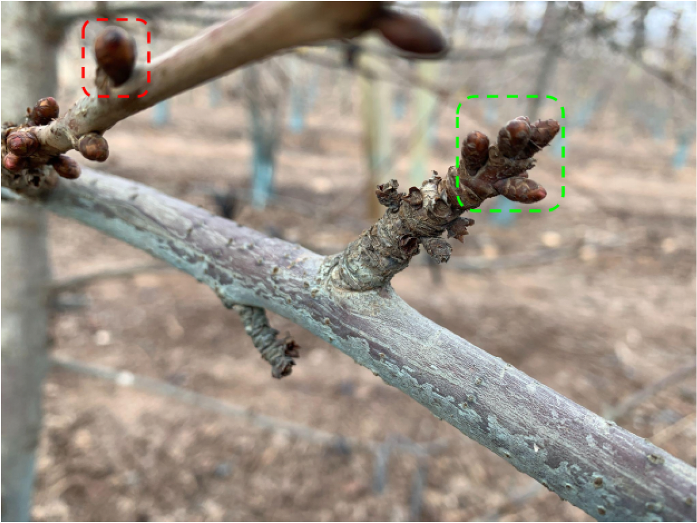
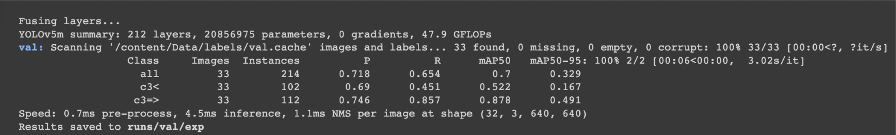
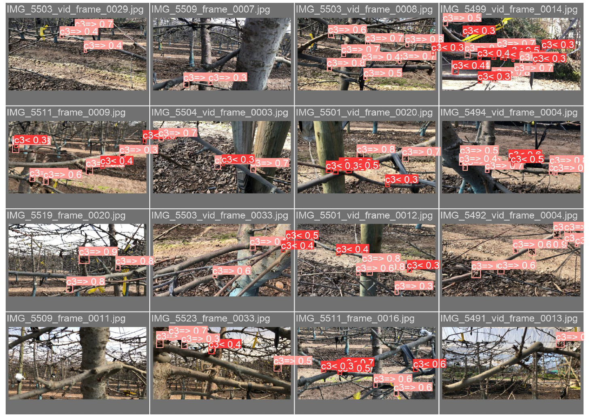

# Cherry Bud Counting with Deep Learning🍒

This project leverages artificial intelligence techniques for detecting and counting cherry buds in orchards, focusing only on clusters with three or more buds. To achieve this, a **YOLOv5** object detection model is implemented, combined with the **DeepSort** algorithm for tracking and maintaining detection persistence, avoiding duplicate counts.

## Objectives
- Train a **YOLOv5** model to detect cherry buds in images and videos.
- Implement **DeepSort** to track detected buds and prevent duplicate counting.
- Optimize the model for real-world applications in cherry orchards.

## Methodology
The model development followed these stages:
1. **Data Collection**: Gathered **800 images and 200 videos** of cherry buds in different scenarios.
2. **Labeling and Preprocessing**: Created over **5000 labels** manually using *LabelImg*, ensuring proper classification of clusters of interest.
3. **YOLOv5 Training**: Tested various model configurations, achieving an **83% detection accuracy**.
4. **Integration with DeepSort**: Configured the tracking algorithm to maintain bud identity in videos and avoid counting errors.

## Results
The model achieved an **87% mAP** and **74.6% precision**, effectively detecting clusters of 3 or more buds. Additionally, the integration with DeepSort improved detection stability in videos, ensuring precise counting.

This project demonstrates the feasibility of using computer vision models to automate bud counting in cherry orchards, optimizing agricultural processes through artificial intelligence.

## Example of Detection and Tracking

Here you can watch a video with the results:  

📌 **Google Drive:**  
[📹 Ver Video en Google Drive](https://drive.google.com/file/d/1aVlfPb2faK_1FdpfB963sCQz1F6UHq44/view?usp=sharing)

