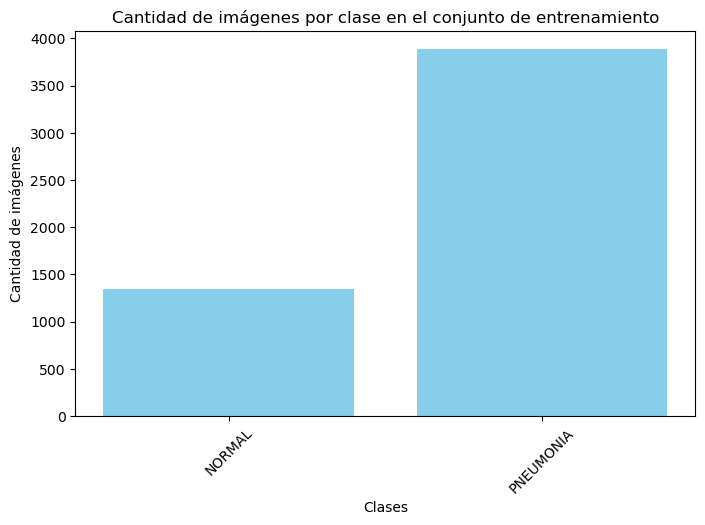

# 🧑‍🔬 Machine Learning & Deep Learning Project  

  This project was developed using **TensorFlow** and **PyTorch** to implement and compare different machine learning and deep learning models. In this repository, we will specifically describe the code implemented using **TensorFlow**. The general steps followed in this project are outlined below.  

  The general steps followed in this project are outlined below.  

## 📌 General Workflow  

1. **Importing Required Packages and Modules**
   The following packages were used for various stages of the project:
   ```python
   import os
   import shutil
   import zipfile
   import random
   import glob
   import cv2
   import numpy as np
   import tensorflow as tf
   import matplotlib.pyplot as plt
   import seaborn as sns
   from tensorflow.keras.preprocessing.image import ImageDataGenerator
   from tensorflow.keras.applications import ResNet50
   from tensorflow.keras.layers import Dense, GlobalAveragePooling2D, Dropout
   from tensorflow.keras.models import Model
   from sklearn.metrics import accuracy_score, f1_score, classification_report, confusion_matrix

3. **Data Loading**
To load and preprocess the data, the following steps were performed:
```python
# Configure paths
data_path = "data/xrays"
zip_path = "data/xrays.zip"
plot_dir = "plots"

# Create plot directory if it doesn't exist
os.makedirs(plot_dir, exist_ok=True)

# Remove existing data folder if it exists
if os.path.exists(data_path):
    shutil.rmtree(data_path)
print(f"Folder '{data_path}' removed successfully.")

# Unzip data if it doesn't exist
if not os.path.exists(data_path):
    with zipfile.ZipFile(zip_path, 'r') as zip_ref:
        zip_ref.extractall(data_path)
    print("Data unzipped successfully.")

# Function to save plots
def save_plot(filename):
    path = os.path.join(plot_dir, filename)
    plt.savefig(path, bbox_inches='tight')
    print(f"Plot saved at: {path}")
    plt.close()

# Image preprocessing
def preprocess_input_with_norm(image):
    return tf.image.per_image_standardization(image)

# Data augmentation and data loading
train_datagen = ImageDataGenerator(preprocessing_function=preprocess_input_with_norm)
test_datagen = ImageDataGenerator(preprocessing_function=preprocess_input_with_norm)

train_data = train_datagen.flow_from_directory(f"{data_path}/train", target_size=(224, 224), batch_size=32, class_mode='binary')
test_data = test_datagen.flow_from_directory(f"{data_path}/test", target_size=(224, 224), batch_size=32, class_mode='binary', shuffle=False)


3. **Data Visualization**
In this step, we visualize the distribution of the dataset to understand the class balance in the training data.

# Visualize data distribution
class_names = list(train_data.class_indices.keys())
class_counts = [len(os.listdir(os.path.join(f"{data_path}/train", cls))) for cls in class_names]

plt.figure(figsize=(8, 5))
plt.bar(class_names, class_counts, color='skyblue')
plt.xlabel('Classes')
plt.ylabel('Number of Images')
plt.title('Number of Images per Class in the Training Set')
plt.xticks(rotation=45)
save_plot("data_distribution.png")
```



4. **Data Preprocessing and Augmentation**

In this step, we perform the necessary data processing and normalization to prepare the dataset for training.

```python
# hola

5. **Building the Models**  
6. **Compiling and Training the Models**  
7. **Model Evaluation on Validation Data**  
8. **Model Performance Visualization**  
9. **Output Prediction and Probability Estimation on Test Data**  

