# [...Work in progress..]💰Financial Fraud Detection
**Note:** This repository is in work progress.

## Introduction

This repository focuses on financial fraud detection using machine learning techniques, with a particular emphasis on the article titled "Financial fraud detection through the application of machine learning techniques: a literature review." The article provides a comprehensive review of the various methodologies used for fraud detection in the financial sector, analyzing approaches ranging from traditional methods to more advanced techniques.

## Dataset
Finding an available dataset for financial fraud detection can be quite challenging due to the sensitive nature of the data involved. Most financial institutions and organizations keep such datasets private to protect user information and prevent misuse. As a result, access to real-world datasets is often difficult.
Here, we will use a dataset obtained from this article "Yang Bao, Bin Ke, Bin Li, Julia Yu, and Jie Zhang (2020). Detecting Accounting Fraud in Publicly Traded U.S. Firms Using a Machine Learning Approach. Journal of Accounting Research, 58 (1): 199-235."

You can download the dataset from here:  
[📥 Download Dataset](https://docs.google.com/spreadsheets/d/1ANOYFKEC7GJtriPFpXc3PNvHanHP3oXJ/edit?usp=share_link&ouid=111569509993326914459&rtpof=true&sd=true)

This dataset contains financial data from companies traded on the NYSE, NASDAQ, NYSE American, and other markets. Here, the variable "misstate" is the fraud label (1 denotes fraud, and 0 denotes non-fraud).

### The description of the 28 raw accounting variables are as follows:

- **act**: Current Assets, Total  
- **ap**: Account Payable, Trade  
- **at**: Assets, Total  
- **ceq**: Common/Ordinary Equity, Total  
- **che**: Cash and Short-Term Investments  
- **cogs**: Cost of Goods Sold  
- **csho**: Common Shares Outstanding  
- **dlc**: Debt in Current Liabilities, Total  
- **dltis**: Long-Term Debt Issuance  
- **dltt**: Long-Term Debt, Total  
- **dp**: Depreciation and Amortization  
- **ib**: Income Before Extraordinary Items  
- **invt**: Inventories, Total  
- **ivao**: Investment and Advances, Other  
- **ivst**: Short-Term Investments, Total  
- **lct**: Current Liabilities, Total  
- **lt**: Liabilities, Total  
- **ni**: Net Income (Loss)  
- **ppegt**: Property, Plant and Equipment, Total  
- **pstk**: Preferred/Preference Stock (Capital), Total  
- **re**: Retained Earnings  
- **rect**: Receivables, Total  
- **sale**: Sales/Turnover (Net)  
- **sstk**: Sale of Common and Preferred Stock  
- **txp**: Income Taxes Payable  
- **txt**: Income Taxes, Total  
- **xint**: Interest and Related Expense, Total  
- **prcc_f**: Price Close, Annual, Fiscal  

### The description of the 14 financial ratio variables are as follows:

- **dch_wc**: WC accruals  
- **ch_rsst**: RSST accruals  
- **dch_rec**: Change in receivables  
- **dch_inv**: Change in inventory  
- **soft_assset**: % Soft assets  
- **dpi**: Depreciation index  
- **ch_cs**: Change in cash sales  
- **ch_cm**: Change in cash margin  
- **ch_roa**: Change in return on assets  
- **ch_fcf**: Change in free cash flows  
- **reoa**: Retained earnings over total assets  
- **EBIT**: Earnings before interest and taxes over total assets  
- **issue**: Actual issuance  
- **bm**: Book-to-market

### 1.Exploratory data analysis:

The plots show the number of fraud and non-fraud cases on a logarithmic scale as a function of years. Here, we can note that there is a significant imbalance between fraud and non-fraud cases. What can we do about it? There are several solutions to this problem, such as undersampling and oversampling. In this work, we will use undersampling, which reduces the size of the majority class (non-fraud data).

### 2.Model:
Implementation of logistic regression for fraud detection. First, we will train a Logistic Regression model with data from 1990-2011 and evaluate it with data from 2011-2014. We will assess the performance of the Logistic Regression models by employing techniques such as oversampling, undersampling, and addressing class imbalance.

The AUC obtained in all models is not good, as it is close to 0.5 (equivalent to a random model). One question that arises is whether AUC is the correct metric for this case. We cannot rely solely on the AUC metric; instead, we should select the appropriate evaluation metric based on the specific problem we are modeling. In the confusion matrices, we can see that when we balance the data, the model starts to learn about the fraud cases. Other metrics that we want to considerer are the precision and recall. Precision metric indicates, of all the cases that the model predicted as positive, how many were actually positive **(useful when false positives are costly)**. Recall metric, on the other hand, indicates, of all the actual positive cases, how many were correctly identified by the model **(useful when false negatives are costly)**.

There are numerous machine learning models that can be employed for fraud detection, each with distinct advantages depending on the dataset and specific requirements of the task. Among the many options available, LightGBM and RUSBoost stand out as particularly effective approaches. 

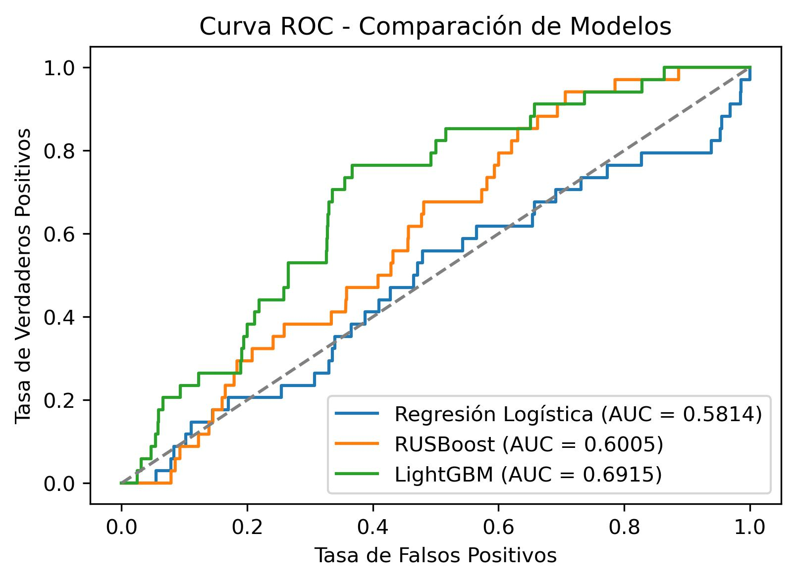

The figure shows the performance of Logistic Regression (with undersampling), LightGBM, and RUSBoost in fraud detection. The results indicate that LightGBM achieved the highest score in the AUC metric.

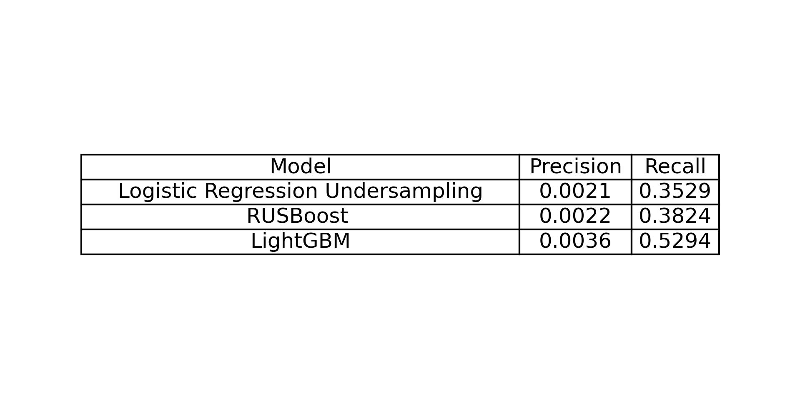
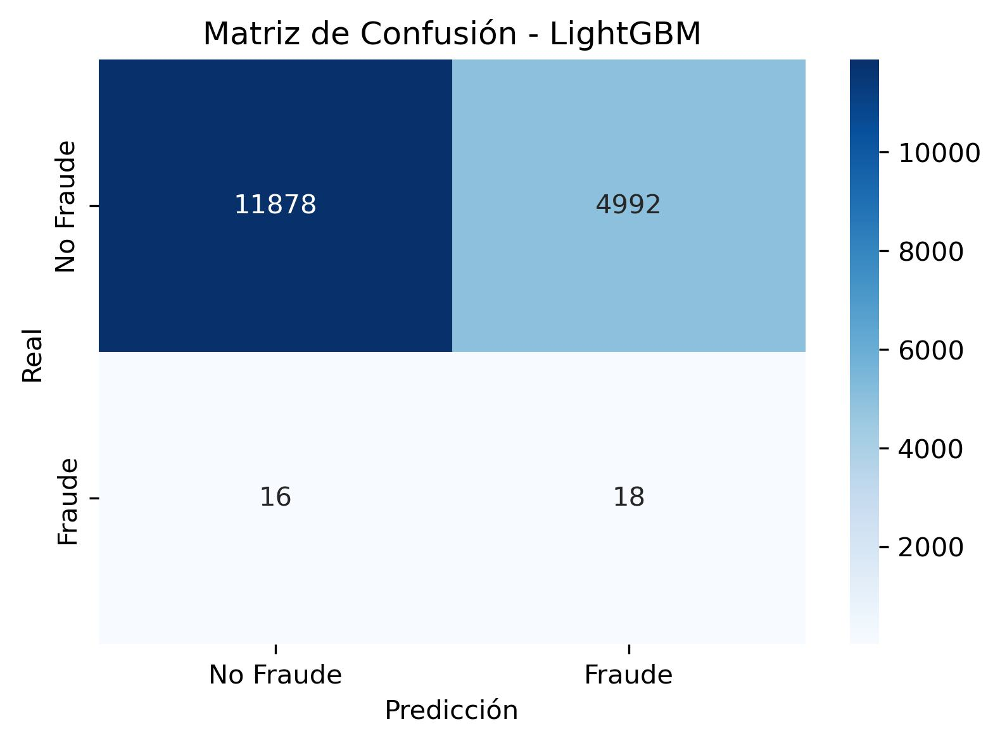

Moreover, the LightGBM model attained the highest scores in both precision and recall metrics.

### 3.how we can further improve the model?:
From this point on, we will focus on improving the performance of the LightGBM model. To achieve this, we will use Wrapper Methods for feature selection, which help identify the most relevant features. Specifically, we will apply Recursive Feature Elimination (RFE) to enhance the model’s effectiveness.

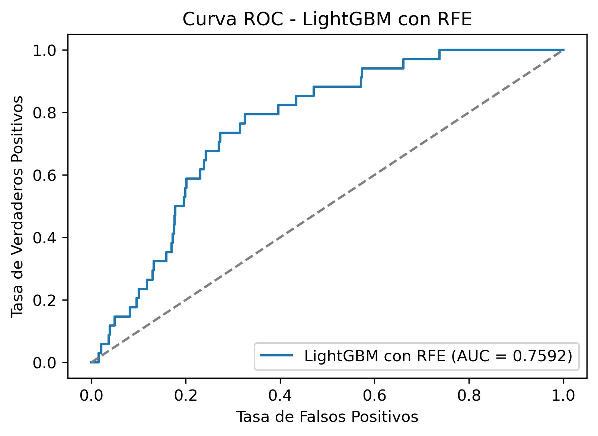
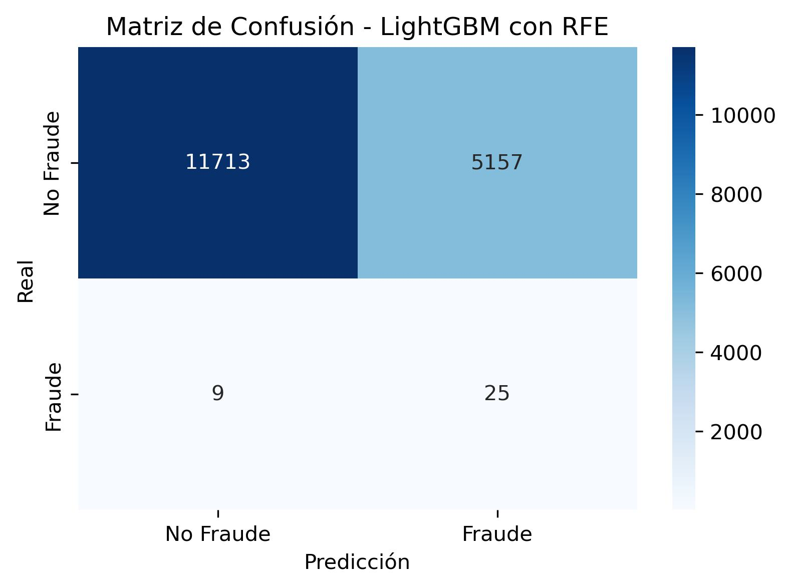
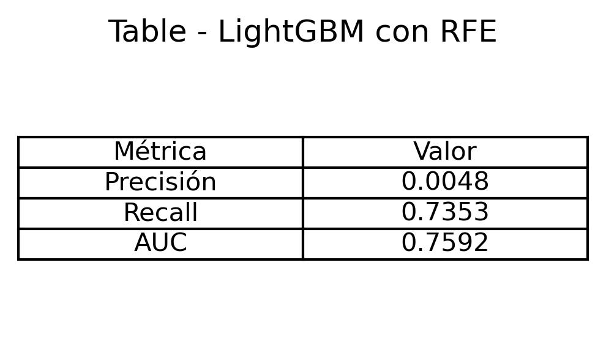

As we can see in the figure, we have successfully improved metrics such as AUC (from 0.6915 to 0.7592), precision (from 0.0036 to 0.0048), and recall (from 0.5294 to 0.7353). These are good results, but the key questions are: can we improve the model further? What do we really want to optimize?

In the tax fraud detection problem, our main goal is to minimize false negatives (fraud cases that our model fails to detect). Therefore, we need to focus on improving the **recall metric**.

On the other hand, let us imagine that we were working in a consulting firm and our goal was to identify fraudulent cases, we would need to review with certainty the **25 + 5.157** cases flagged as fraudulent by the model.

Therefore, another important aspect to consider for improving our model is reducing false positives—cases that are mistakenly classified as fraud. Lowering the number of false positives would not only improve the model’s precision but also reduce the workload required for case review. **How can we do this? This is the next task, and maybe using deep learning we can achieve it.**

### 4. Deep Neural Network model:
The implemented model consists of a dense neural network (DNN) with multiple layers, designed to capture complex relationships among financial variables. The ReLU activation function is used in the hidden layers to enhance learning capacity, while the sigmoid function is applied in the output layer to obtain a fraud probability. Optimization is performed using the Adam algorithm, and the loss function employed is binary crossentropy, given the binary nature of the problem. The DNN model is composed of: 

-  first hidden layer with 128 neurons and ReLU activation.
- second hidden layer with 64 neurons and ReLU activation.
-  third hidden layer with 32 neurons and ReLU activation.
- fourth hidden layer with 16 neurons and ReLU activation.
-  output layer with 1 neuron and sigmoid activation to generate a fraud probability.

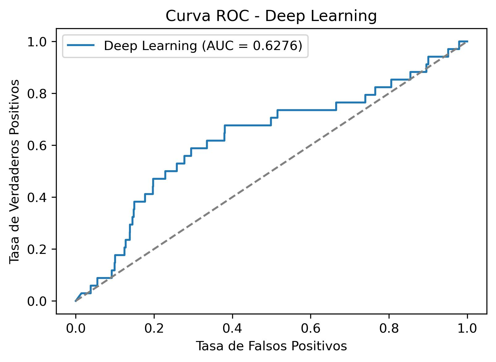
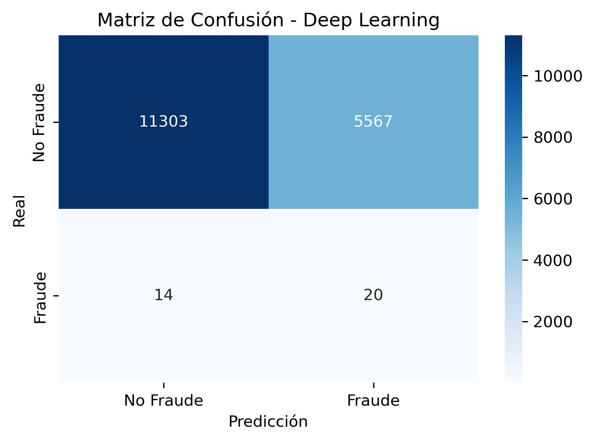
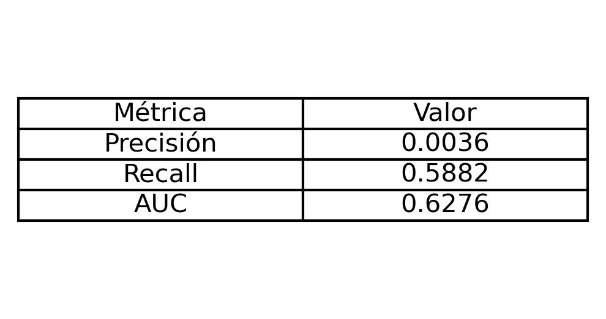

### 5. K-Nearest Neighbors model:
Here, we will focus on a K-Nearest Neighbors (KNN) approach for financial fraud detection. Unlike Deep Learning models, KNN is an instance-based algorithm that classifies new observations based on their similarity to the nearest neighbors. We will implement this model after applying feature selection and data balancing techniques. Furthermore, the optimal value of **K** for the KNN model is determined through a parameter search using GridSearchCV, optimizing recall to maximize fraud detection.

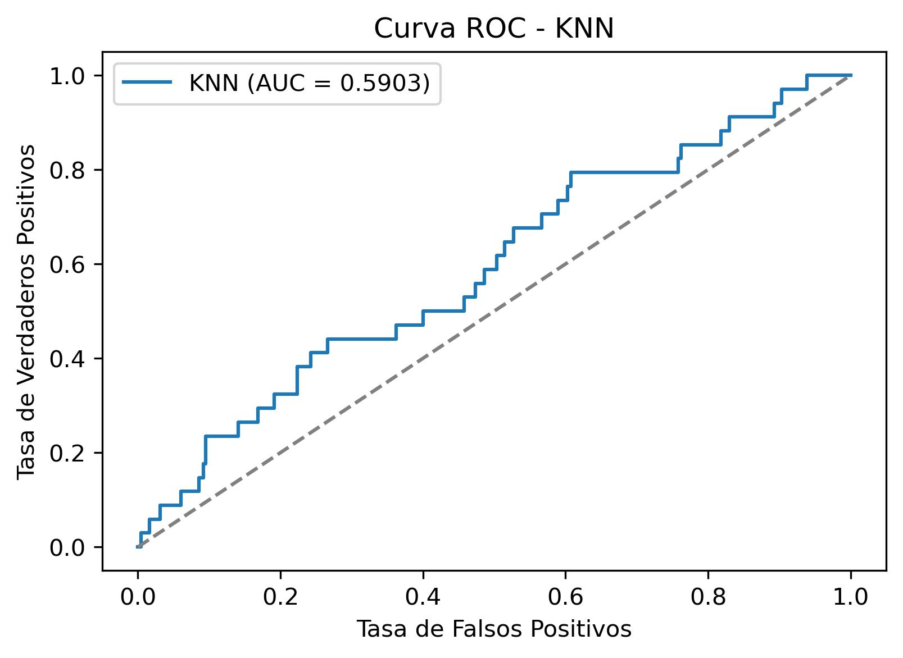
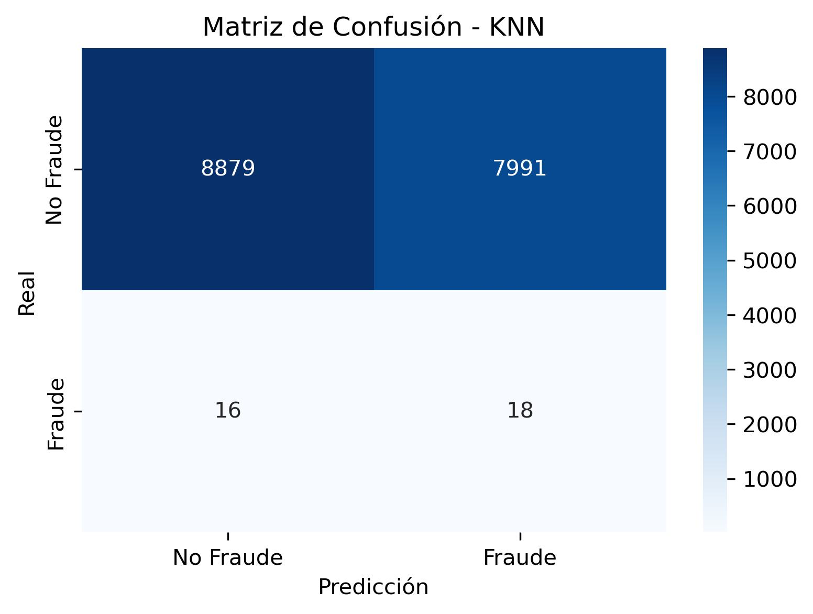
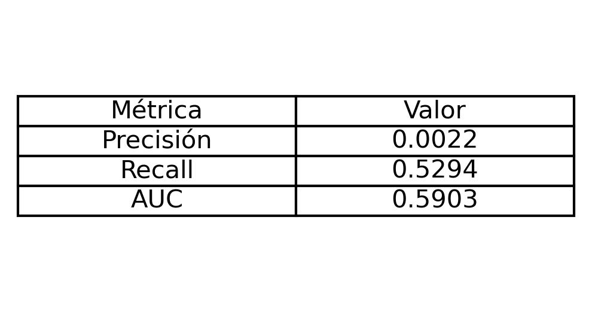

### 5. Quantum machine learning:
Quantum Machine Learning (QML) is an emerging field that explores the intersection between quantum computing and machine learning. Its goal is to leverage the properties of quantum systems, such as superposition, entanglement, and interference, to enhance the efficiency and performance of machine learning algorithms. Here, we will employ a quantum neural network for financial fraud detection.

