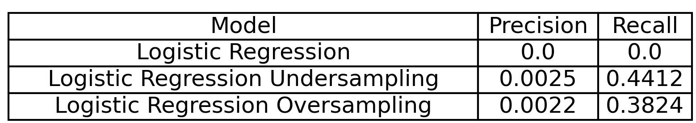

# [...Work in progress..]💰Financial Fraud Detection
**Note:** This repository is in work progress.

## Introduction

This repository focuses on developing and implementing machine learning models to detect financial fraud efficiently. 

## Dataset

You can download the dataset from here:  
[📥 Download Dataset](https://docs.google.com/spreadsheets/d/1ANOYFKEC7GJtriPFpXc3PNvHanHP3oXJ/edit?usp=share_link&ouid=111569509993326914459&rtpof=true&sd=true)

This dataset contains financial data from companies traded on the NYSE, NASDAQ, NYSE American, and other markets. Here, the variable "misstate" is the fraud label (1 denotes fraud, and 0 denotes non-fraud).

### The description of the 28 raw accounting variables are as follows:

- **act**: Current Assets, Total  
- **ap**: Account Payable, Trade  
- **at**: Assets, Total  
- **ceq**: Common/Ordinary Equity, Total  
- **che**: Cash and Short-Term Investments  
- **cogs**: Cost of Goods Sold  
- **csho**: Common Shares Outstanding  
- **dlc**: Debt in Current Liabilities, Total  
- **dltis**: Long-Term Debt Issuance  
- **dltt**: Long-Term Debt, Total  
- **dp**: Depreciation and Amortization  
- **ib**: Income Before Extraordinary Items  
- **invt**: Inventories, Total  
- **ivao**: Investment and Advances, Other  
- **ivst**: Short-Term Investments, Total  
- **lct**: Current Liabilities, Total  
- **lt**: Liabilities, Total  
- **ni**: Net Income (Loss)  
- **ppegt**: Property, Plant and Equipment, Total  
- **pstk**: Preferred/Preference Stock (Capital), Total  
- **re**: Retained Earnings  
- **rect**: Receivables, Total  
- **sale**: Sales/Turnover (Net)  
- **sstk**: Sale of Common and Preferred Stock  
- **txp**: Income Taxes Payable  
- **txt**: Income Taxes, Total  
- **xint**: Interest and Related Expense, Total  
- **prcc_f**: Price Close, Annual, Fiscal  

### The description of the 14 financial ratio variables are as follows:

- **dch_wc**: WC accruals  
- **ch_rsst**: RSST accruals  
- **dch_rec**: Change in receivables  
- **dch_inv**: Change in inventory  
- **soft_assset**: % Soft assets  
- **dpi**: Depreciation index  
- **ch_cs**: Change in cash sales  
- **ch_cm**: Change in cash margin  
- **ch_roa**: Change in return on assets  
- **ch_fcf**: Change in free cash flows  
- **reoa**: Retained earnings over total assets  
- **EBIT**: Earnings before interest and taxes over total assets  
- **issue**: Actual issuance  
- **bm**: Book-to-market

### 1.Exploratory data analysis:

The plots show the number of fraud and non-fraud cases on a logarithmic scale as a function of years. Here, we can note that there is a significant imbalance between fraud and non-fraud cases. What can we do about it? There are several solutions to this problem, such as undersampling and oversampling. In this work, we will use undersampling, which reduces the size of the majority class (non-fraud data).

### 2.Model:
Implementation of logistic regression for fraud detection. First, we will train a Logistic Regression model with data from 1990-2011 and evaluate it with data from 2011-2014. We will assess the performance of the Logistic Regression models by employing techniques such as oversampling, undersampling, and addressing class imbalance.

The AUC obtained in all models is not good, as it is close to 0.5 (equivalent to a random model). One question that arises is whether AUC is the correct metric for this case. We cannot rely solely on the AUC metric; instead, we should select the appropriate evaluation metric based on the specific problem we are modeling. In the confusion matrices, we can see that when we balance the data, the model starts to learn about the fraud cases. Other metrics that we want to considerer are the precision and recall. Precision metric indicates, of all the cases that the model predicted as positive, how many were actually positive **(useful when false positives are costly)**. Recall metric, on the other hand, indicates, of all the actual positive cases, how many were correctly identified by the model **(useful when false negatives are costly)**.

There are numerous machine learning models that can be employed for fraud detection, each with distinct advantages depending on the dataset and specific requirements of the task. Among the many options available, LightGBM and RUSBoost stand out as particularly effective approaches. 

